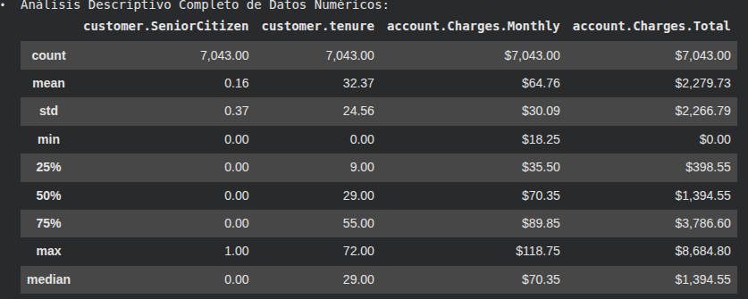
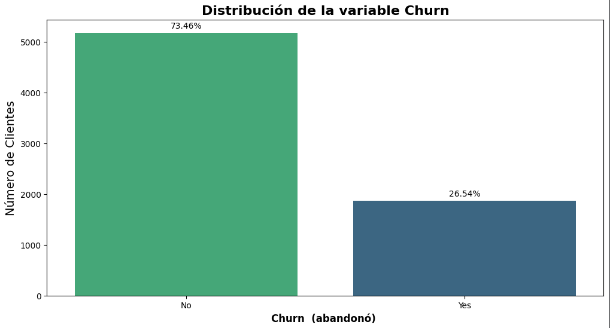
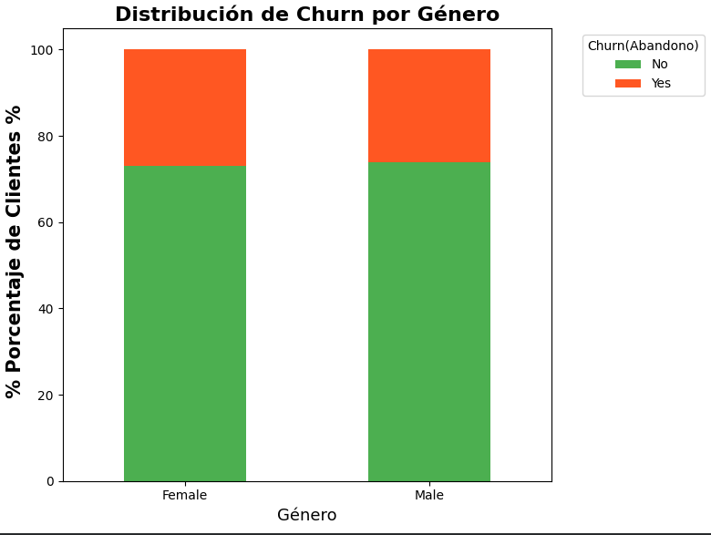
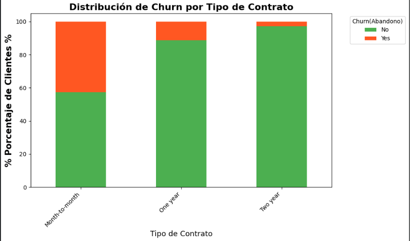
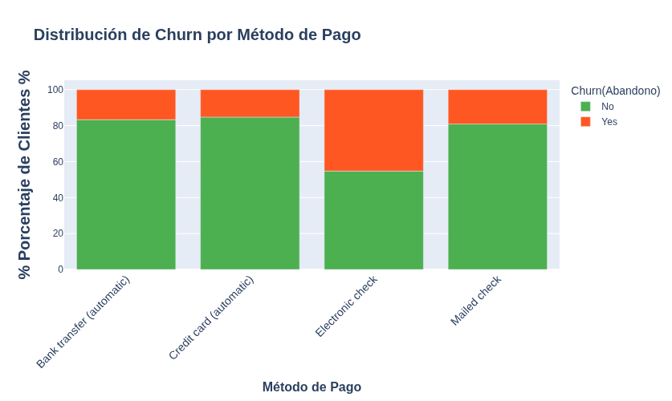
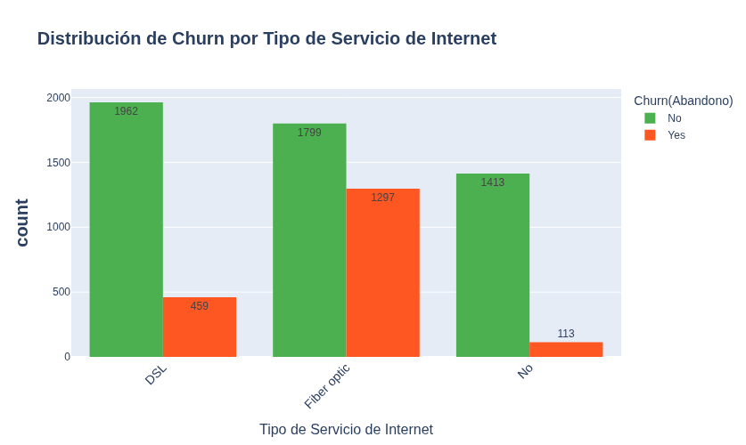
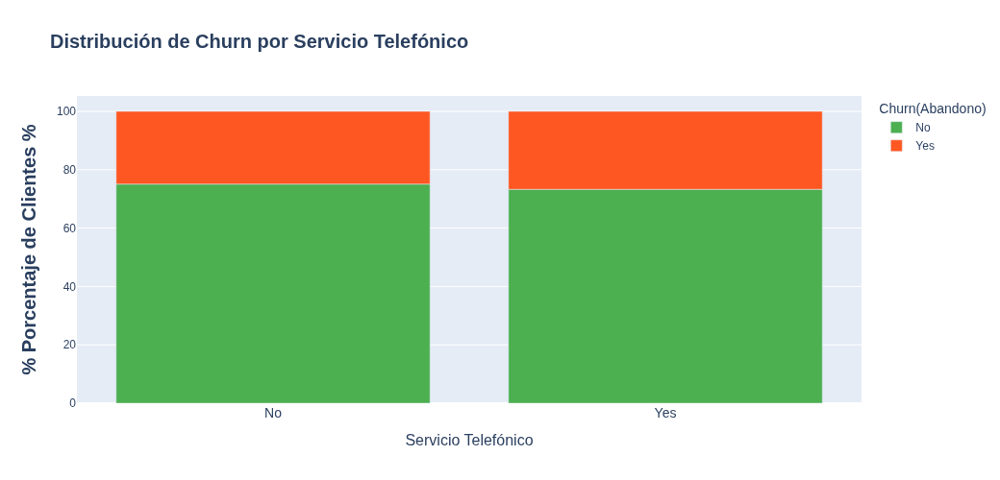
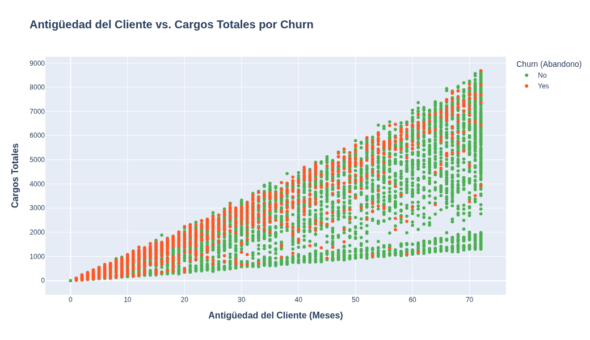

# challenge_Telecom-X_parte_uno
# 📊 Análisis de Retención de Clientes (Churn) - Telecom X


Durante este desafío, he analizado los datos de clientes de Telecom X para comprender los factores que influyen en la **pérdida de clientes (Churn)**. El objetivo principal es transformar datos brutos en información estratégica, permitiendo a Telecom X mejorar la retención de sus clientes y reducir la tasa de abandono del 26.5%.

## 🚀 Descripción del Proyecto

En este repositorio se realiza un proceso completo de Ciencia de Datos aplicado al problema de Churn en Telecom X, que incluye:

*   **Exploración de Datos (EDA)**: Análisis de estadísticas descriptivas y visualización de tendencias clave.
*   **Limpieza y Transformación de Datos**: Tratamiento de valores nulos, espacios vacíos, duplicados y corrección de tipos de datos para asegurar la calidad de la información.
*   **Análisis Predictivo**: Este proyecto se centra en identificar patrones y variables influyentes en la decisión de los clientes de abandonar el servicio.
*   **Visualización**: Creación de gráficos interactivos y estáticos para comunicar los hallazgos de manera efectiva.
*   **Interpretación y Storytelling**: Traducción de hallazgos técnicos en recomendaciones de negocio accionables para mejorar la retención.

## 🛠️ Tecnologías Utilizadas

*   **Python 3.12.12**
*   **Pandas**: Manipulación, limpieza y análisis de datos.
*   **Requests**: Para la extracción de datos de APIs (JSON).
*   **Numpy**: Operaciones numéricas y manejo eficiente de arrays.
*   **Matplotlib / Seaborn**: Visualización de datos estáticos.
*   **Plotly Express**: Creación de gráficos interactivos y dinámicos.
*   **Google Colab**: Entorno de desarrollo en la nube.

## ⚙️ Instalación y Uso

Para replicar este análisis, sigue los siguientes pasos:

1.  **Clonar el repositorio**:
    ```bash
    git clone https://github.com/Harold-dev-code/challenge_Telecom-X_parte_uno.git
    ```
2.  **Abrir el Notebook**: Ingresa a la carpeta que se descargo y abre el archivo `challenge_Telecom-X_parte_uno.ipynb` en tu entorno Jupyter o súbelo a Google Colab.
3.  **Ejecutar las celdas**: Ejecuta todas las celdas del notebook en orden para replicar el proceso de extracción, transformación, análisis y visualización.

## Contenido del Notebook

El notebook está estructurado en las siguientes secciones, reflejando el flujo del proyecto:

### Etapa 1: Extract (Extracción) 📥
1.  **Conexión con la Fuente de Datos**: Obtención del archivo JSON desde GitHub utilizando `requests`.
2.  **Aplanamiento de Datos**: Uso de `pd.json_normalize` para convertir diccionarios anidados en columnas independientes.
3.  **Verificación Inicial**: Primera visualización de los datos (`df.head()`).

### Etapa 2: Transform (Transformación) ⚙️
1.  **Revisión de Datos**: Análisis de `df.info()` para tipos de datos y nulos.
2.  **Valores Duplicados y Nulos**: Verificación de la ausencia de duplicados y nulos explícitos.
3.  **Auditoría Integral**: Revisión detallada por columna para identificar espacios vacíos y valores atípicos (0 en `tenure` o `Charges.Total`).
4.  **Tratamiento de `Churn`**: Eliminación de registros con espacios vacíos en la variable objetivo.
5.  **Tratamiento de `account.Charges.Total`**: Conversión a tipo numérico y reemplazo de espacios vacíos por `0.0`.

### Etapa 3: Load (Carga) 💾 & Análisis
1.  **Análisis Descriptivo**: Estadísticas básicas de columnas numéricas (`describe()`, `median()`).
    <p align="center">
      
    </p>
3.  **Distribución de Churn**: Visualización del porcentaje de clientes que abandonan y que permanecen.
    <p align="center">
      
    </p>
5.  **Churn por Variables Categóricas**: Exploración de la tasa de abandono en relación con `gender`, `Contract`, `PaymentMethod`, `InternetService`, `PhoneService`.
    <p align="center">
      
    </p>
    <p align="center">
      
    </p><p align="center">
      
    </p>
    <p align="center">
      
    </p>
      <p align="center">
      
    </p>
7.  **Churn por Variables Numéricas**: Análisis de la relación entre `Churn` y `tenure`, `account.Charges.Monthly`, `account.Charges.Total`.
    <p align="center">
      
    </p>
### Informe Final

Sección dedicada a consolidar la introducción, limpieza de datos, hallazgos clave y recomendaciones estratégicas.

## 📈 Hallazgos y Conclusiones Clave

*   La tasa de abandono es del **26.5%**, una cifra significativa que justifica este análisis.
*   **Clientes nuevos** (baja `tenure`) son los más propensos a abandonar el servicio.
*   Los **contratos mes a mes** tienen una tasa de churn del **42.7%**, casi cuatro veces más alta que los contratos a largo plazo.
*   Los usuarios de **Fibra Óptica** presentan una tasa de abandono inesperadamente alta (**41.9%**), sugiriendo problemas subyacentes.
*   El **Cheque Electrónico** es el método de pago con mayor churn (**45.3%**).
*   **Altos cargos mensuales** están correlacionados con una mayor propensión al abandono.

## ✅ Recomendaciones Estratégicas

1.  **Blindaje de Contratos**: Campañas para convertir contratos mensuales a anuales/bianuales con incentivos.
2.  **Auditoría de Fibra Óptica**: Investigación de la calidad del servicio y la percepción de valor para usuarios de fibra.
3.  **Migración de Métodos de Pago**: Incentivos para que los clientes abandonen el 'Cheque Electrónico' a favor de opciones más estables.
4.  **Programa de Bienvenida "Golden First Year"**: Estrategias de retención intensivas durante los primeros 12 meses de vida del cliente.
5.  **Conciliación Proactiva**: Contacto con clientes de alto consumo para asegurar su satisfacción y prevenir fugas.

## 👤 Autor

Desarrollado por [Harold-dev-code](https://github.com/Harold-dev-code).
Dentro del programa de formación ONE - Oracle Next Education de Oracle y Alura Latam https://www.oracle.com/latam/education/oracle-next-education/

## ⚖️ Licencia

Este proyecto está bajo la Licencia MIT - mira el archivo [LICENSE](LICENSE) para más detalles.

